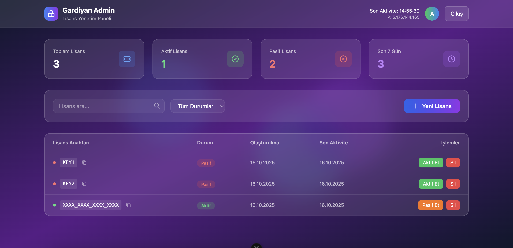

# 🛡️ Gardiyan - Open source licensing solution

A modern, high-security license validation and management solution. Built with Django REST Framework and React.




## Backend Setup

> ./licensing

```
pip install -r requirements.txt
```

## Setup Web API

1 - Locate the directory
```
cd licensing
```

2 - Migration operations
```
python manage.py migrate
```

3 - Create a superuser
```
python manage.py createsuperuser
```

4 - Run API
```
python manage.py runserver
```

## Adding New Licenses
#### 1 - Add license from admin panel
Login your admin panel from `https://your-domain.com/admin/` and add new license from Licenses area.

#### 2 - REST API
POST request to /api/licenses (login required!)

```json
{
    "key":"ENTER_EXAMPLE_LICENSE_KEY",
    "author":1
}
```

author 1 is a default for admin user.

Login endpoint: `/api/login`.


## Python Integration
```python
# Test application using PyLicense
import pylicense


API_URL = 'http://127.0.0.1:8000/api/licenses' # Enter your pylicense api

def main():
    username = input('username: ')
    password = input('password: ')

    license = pylicense.License(API_URL,app_key='examplekey1')
    operation = pylicense.run(API_URL, username, password, license=license)

    # Controller
    for x in operation: # x: License object
        check = license.check_license(x['key'])
        if check:
            print('License found!')
        else:
            print('License not found!')

if __name__ == '__main__':
    main()
```

## Frontend Setup
> ./frontend

```
cd frontend
npm install
npm run dev
```

and check frontend in [http://localhost:5173](http://localhost:5173)

## License
This project is licensed under the GPLv3.0 License. For more information, please see the [LICENSE](LICENSE) file.
